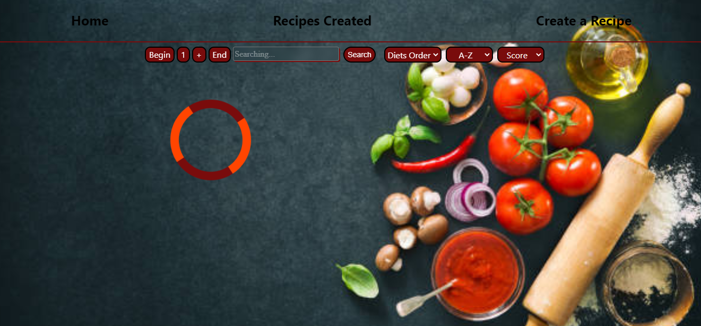

# Recipes Food

- Deploy front: https://recipesjb.vercel.app/
- Deploy back routes:
- Recipes: https://apirecipes.onrender.com/recipesAll
- Diets: https://apirecipes.onrender.com/diets
- Recipes Created: https://apirecipes.onrender.com/recipesCreated


<div class="display: flex; flex-wrap: wrap;">

# Landing   Card    Spinner
  

# Details   Created  form to create
  

</div>


T### Project Title

Concise description of the project and its purpose.

---

#### Technologies Used

- HTML
- CSS
- JavaScript
- React
- Redux
- PostgreSQL
- Express
- Node.js

---

#### Project Structure

- **Frontend (Vite):**
  - Folder: `foodAppJB`
  - Port: `5173`
  - Deployment: Developed with Vite, the frontend is located in the `foodAppJB` folder and is deployed on port `5173`.

- **Backend:**
  - Folder: `API`
  - Port: `3000`
  - Deployment: The backend is located in the `API` folder and runs on port `3000`.

---

#### Execution Instructions

1. **Frontend (Vite):**
   - Navigate to the `foodAppJB` folder in the terminal.
   - Run the following command to install dependencies:
     ```bash
     npm install
     ```
   - Start the development server on port `5173` with the following command:
     ```bash
     npm run dev
     ```

2. **Backend:**
   - Navigate to the `API` folder in the terminal.
   - Run the following command to install dependencies:
     ```bash
     npm install
     ```
   - Start the server on port `3000` with the following command:
     ```bash
     npm start
     ```

---

#### Folder Structure

- **foodAppJB (Frontend):**
  - Folder: `src` (Frontend source code)
  - Folder: `public` (Public resources)

- **API (Backend):**
  - Folder: `src` (Backend source code)
  - Folder: `config` (Project configurations)
  - Folder: `routes` (Backend routes)
  - Folder: `models` (Database models)
  - ...

---

#### Contributions

Feel free to contribute to the project. Make sure to follow the contribution guidelines in the `CONTRIBUTING.md` file.

---

This is just a basic example, and you can customize it according to the specific needs of your project. Ensure you provide clear and detailed instructions so that other developers can easily understand and contribute.


The recipes data come from spoonaqular api.

Instantly Access a Full Library of Recipes, Ready to Ignite Your Culinary Inspiration! 🍲🌟

Key Features:

🔍 Personalized Search: Discover the perfect recipe with our intuitive search bar. Filter by diet, food type (yes, even that delicious salmon!), or simply organize them alphabetically.

📋 Order and Sorting: Tailor your discoveries to your liking. Whether alphabetically or by health score, you'll find the ideal recipe for every occasion.

🔗 In-Depth Details: Dive deep into each recipe with our detailed button. Uncover preparation secrets, special ingredients, and unique tips that will make your culinary experience exceptional.

📝 Create Your Own Recipe: Join the community of chefs and share your culinary creations. Our controlled form makes it easy to contribute and be recognized for your unique culinary skills.

👩‍🍳 Gallery of Created Recipes: Access a special space for your own creations and discover delicious recipes shared by other users. A culinary community in constant growth!

📱 Responsive Design: Enjoy [App Name] on any device. Our application is designed to adapt to your needs, whether on your computer, tablet, or phone.
In other section you can see the recipes exclusively created by users.

And finally through a form you be able to create your own recipe, being able to add an image among others.

