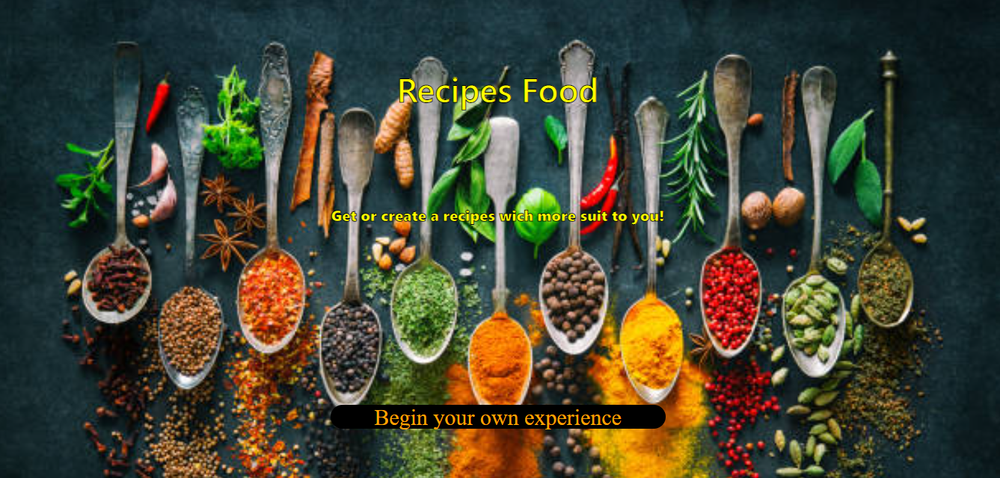
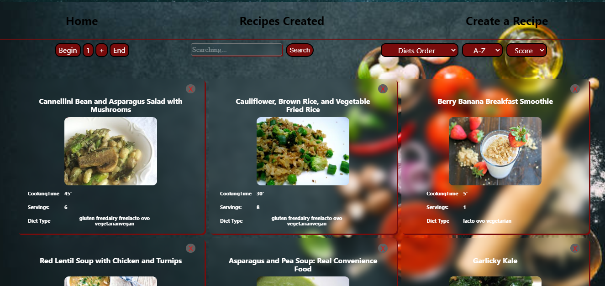
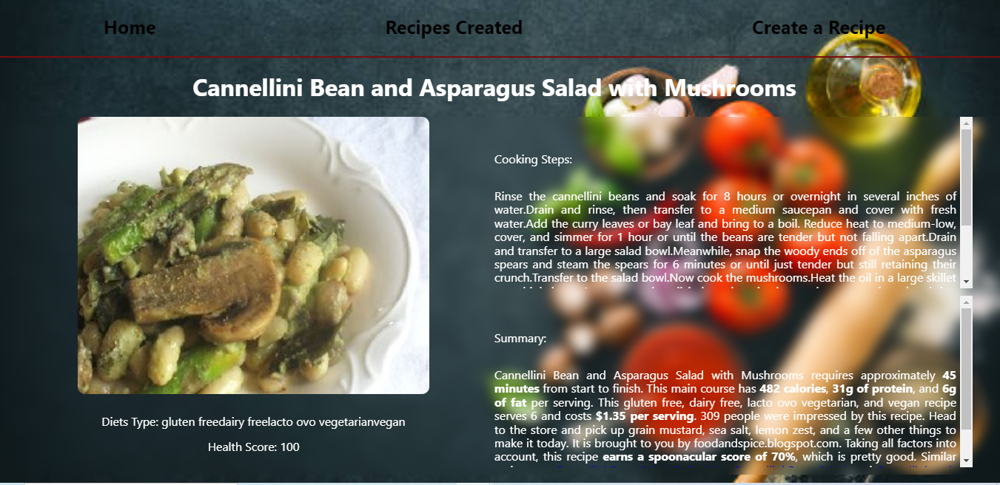
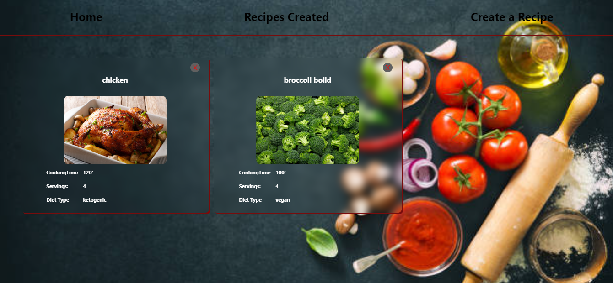
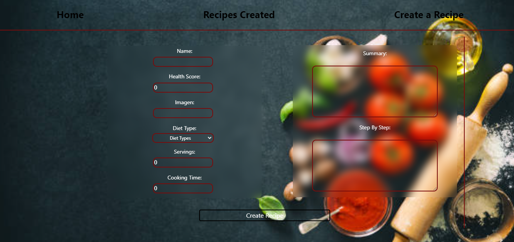

# Recipes Food

- Deploy front: https://recipesjb.vercel.app/
- Deploy back routes:
- Recipes: https://apirecipes.onrender.com/recipesAll
- Diets: https://apirecipes.onrender.com/diets
- Recipes Created: https://apirecipes.onrender.com/recipesCreated

# Landing  # Card   # Spinner
  

# Details / # Created # form to create
  

- The app was made with 
- Front End side: Javascript, React-Redux, CSS.
- Back End side: PostgreSql, Sequelize, Express, RESTapi web.

The recipes data come from spoonaqular api.

Instantly Access a Full Library of Recipes, Ready to Ignite Your Culinary Inspiration! 🍲🌟

Key Features:

🔍 Personalized Search: Discover the perfect recipe with our intuitive search bar. Filter by diet, food type (yes, even that delicious salmon!), or simply organize them alphabetically.

📋 Order and Sorting: Tailor your discoveries to your liking. Whether alphabetically or by health score, you'll find the ideal recipe for every occasion.

🔗 In-Depth Details: Dive deep into each recipe with our detailed button. Uncover preparation secrets, special ingredients, and unique tips that will make your culinary experience exceptional.

📝 Create Your Own Recipe: Join the community of chefs and share your culinary creations. Our controlled form makes it easy to contribute and be recognized for your unique culinary skills.

👩‍🍳 Gallery of Created Recipes: Access a special space for your own creations and discover delicious recipes shared by other users. A culinary community in constant growth!

📱 Responsive Design: Enjoy [App Name] on any device. Our application is designed to adapt to your needs, whether on your computer, tablet, or phone.
In other section you can see the recipes exclusively created by users.

And finally through a form you be able to create your own recipe, being able to add an image among others.

# Images

  

# Landing

#Animated Loader

# Home

# Details

# Recipes Created

# Form to create a recipe

